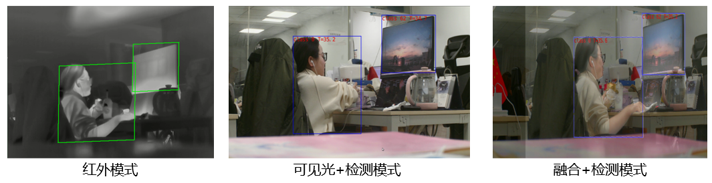
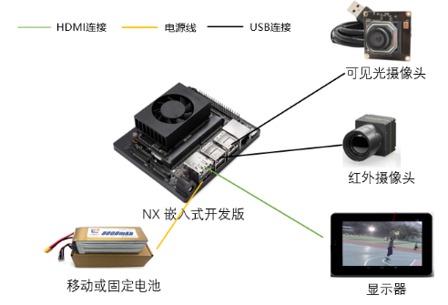
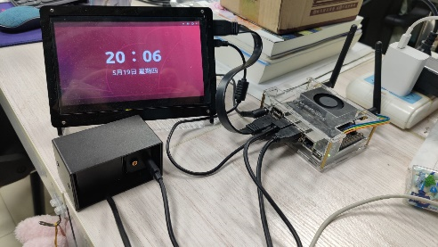
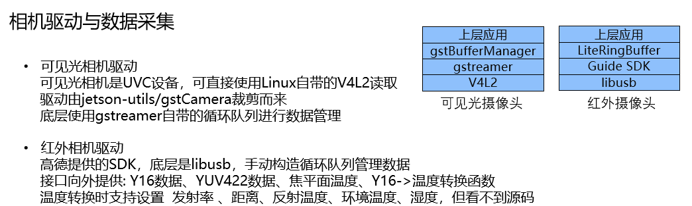
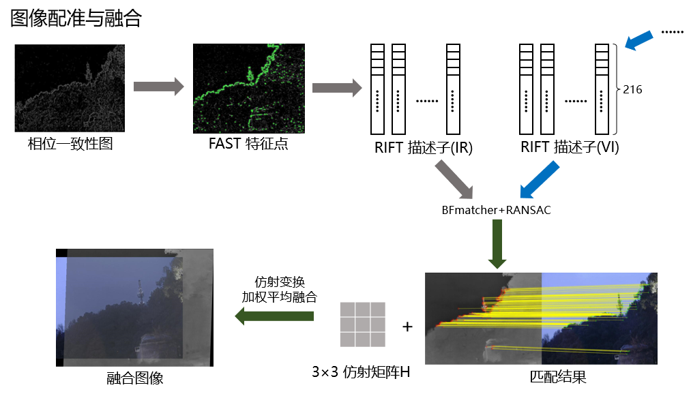
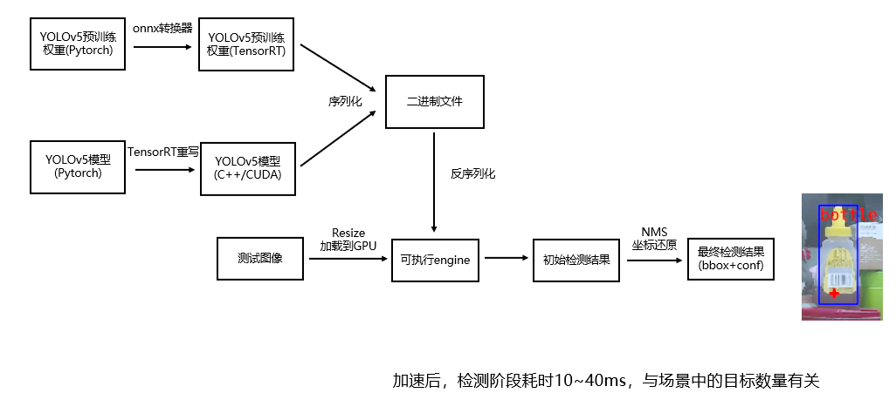
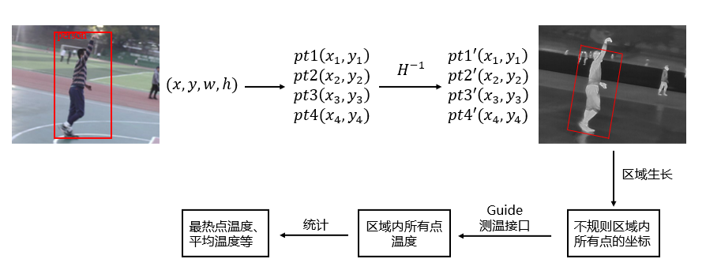
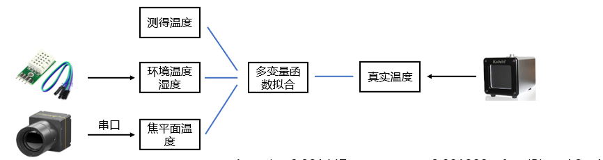

### 项目简介
随着传感器技术和图像处理技术的发展，使用监控进行自主检测和测温逐渐代替传统手工测温方式，广泛应用于食堂、教室、商场等场所。本设计以NVIDIA Jetson Xaiver NX (ARM+GPU)嵌入式开发套件为硬件平台，搭载红外和可见光双目摄像头，在此基础上设计软件功能，通过C++ 语言、利用CUDA编程和多线程技术完成摄像驱动模块、多模态图像配准模块和目标检测与测温模块的开发。

### 硬件平台搭建和设计

硬件连接方案总体设计图如下：

#### **NVIDIA Jetson Xavier NX**

嵌入式开发套装Jetson Xavier NX Developer Kit是英伟达公司推出的一款体型小巧的边缘计算套件，其包含两个部分，Jetson Xavier NX核心板和载板。Jetson Xavier是一块可以提供高达21 TOPS计算性能，包含384个NVIDIA CUDA® Cores、48个Tensor Cores、6 块 Carmel ARM CPU 和两个NVIDIA深度学习加速器 (NVDLA)引擎的高性能嵌入式板。因此，NX嵌入式板足以胜任实时运行基于深度神经网络的目标检测算法。载板上提供4个USB接口，该嵌入式平台也能够满足双目摄像的搭载需求。在本项目中，该嵌入式平台运行的操作系统为Ubuntu18.04。

#### **多模态双目摄像头**

红外摄像头采用高德COIN612（测温型）,可见光摄像头采用锐尔威4K USB摄像头。高德COIN612是高德智感公司开发的一款非制冷型红外探测器，能够采集红外图像以及进行测温。COIN612摄像头的像元间距为12μm，光谱响应范围为8-14μm，支持640×512分辨率的8 bit红外数据输出，帧率为25 HZ，测温工作范围为-10℃+50℃，并支持任意点测温。在工作时，红外摄像头一帧能够获取Y16数据、YUV数据和参数数据三个部分，其中Y16数据和参数数据用于温度的获取，YUV数据为用于显示YUV红外图像，由于内部已经实现了非均匀校正、自适应动态范围压缩和数字降噪，因此项目不再额外添加降噪校正功能。锐尔威视4K USB可见光摄像头为一个USB Video Class(UVC)设备，支持Linux下使用系统驱动器运行，摄像头支持5-30 FPS多种帧率，两种输出模式，分别为YUV和MJPG，最高分辨率3840×2160。

### 软件设计

#### 软件环境

NVIDIA JetPack 4.6

CUDA 10.2

OpenCV 3.4.15

TensorRT 8.0.1.6

JETSON GPIO https://github.com/pjueon/JetsonGPIO

Gstreamer-1.0

OPENMP

#### 双目图像采集模块

红外图像采集代码根据高德红外提供的SDK头文件进行改写，为突破红外相机固定帧率的限制，并且有效节约内存资源，设置循环队列缓冲机制用于存储读取的图像数据。在读取红外图像数据时，每次返回循环缓冲队列的对头数据。此外，为了避免出现不可重复读现象，对每一个缓冲区都增加读写锁机制，从而防止多线程访问冲突。在此设计中，获取的红外图像分辨率设置为为640×512。可见光相机为UVC设备，直接使用Linux自带的V4L2读取，驱动程序通过使用Gstreamer 框架构建管道生成，获取可见光图像分辨率采用1920×1020,数据存储在gstBufferManager 中。

采集红外图像和可将光图像：

   

#### 多模态图像配准模块

**RIFT**论文：[[1804.09493\] RIFT: Multi-modal Image Matching Based on Radiation-invariant Feature Transform (arxiv.org)](https://arxiv.org/abs/1804.09493)

图像配准是测温系统准确度的基础，只有当红外图像和可见光图像配准时，才能够将可见光图像检测的目标区域准确映射到红外图像中，从而完成测温功能。由于红外图像和可见光图像之间巨大模态差异，传统的图像匹配算法例如SIFT无法有效提取特征点。针对此问题，本模块采取多模态图像匹配算法RIFT对来自不同传感器的图像进行匹配。

相位一致性是指在图像的频率域中，边缘相似的特征在同一阶段出现的频率较高。该方法通过傅里叶变换中的相位一致性进行图像边缘的检测，能够不收图像局部光线明暗变换的影响，所得PC图中包含图像中的角线、纹理信息等。 然后，构造3种尺寸、6个不同角度的基于log-Gabor卷积滤波器，与PC图进行卷积处理，从而获取MIM图像并用于特征点的提取。

在获取初步特征点之后，对于每个特征点，采用一个大小为96×96的局部图像块，使用高斯函数为图像块上的每个像素点分配权重，然后将图像块再分成6X6个小块，每一个小块构建一个分布直方图，由于直方图的取值大小是0-6，因此获取 6×6×6的描述子，并将其形变归一化获取216维的向量描述子。最后，基于获得的描述子，采取最小欧式距离的方式选择最多1000对匹配点，通过最小二乘方法获得单应矩阵H，即获取了红外图像至可见光图像和可见光图像至红外图像的像素坐标映射方式。

由于构建MIM图需要进行24次FFT变换和反变换操作，整体耗时达到3秒。因此采用CUFFT库，CUDA核编程和多线程技术进行优化，cudaFunc.cu中为所有CUDA核函数的实现。经过优化之后，配准一对图像的耗时缩减为600ms。

   

此外：针对错误的仿射进行处理  对于单应矩阵H

| a    | b    | c    |
| ---- | ---- | ---- |
| d    | e    | f    |
| g    | h    | i    |

•筛除错误的仿射矩阵

用先验知识约束仿射矩阵的9个参数，在连续帧中去除明显错误的仿射矩阵结果

旋转不大于90°且不存在翻转： a,e>0; 

满足仿射变换而非单应变换：  g=h=0; i=1;

像素位移不可能过大：       c,f≤150

#### 图像融合模块

实现方式参见实验室论文 [实验室论文](https://github.com/jiayi-ma)

#### 目标检测模块

YOLO作为一种端到端的基于深度学习的目标检测算法，相对于其它两阶段目标检测与识别方法，将目标区域预测和目标类别预测整合于单个神经网络模型中，在准确率较高的情况下快速目标检测与识别，非常适用于监控安全、自动驾驶等应用场景。本次设计采用YOLO最新版本YOLOv5-v6.0，参数量大小为46.5M，计算FLOPs为109.1B。为了在嵌入式平台上实现快速目标检测，项目采用TensorRT框架对于算法进行部署加速。其内部通过算子合并，量化、动态张量显存、多流执行等操作加速神经网络在GPU上的运行。部署流程：

#### 测温模块

在获取了目标的位置信息和两幅图像的位置映射关系之后，即可以通过红外摄像机的测温功能将目标的温度测量显示。

根据单应矩阵H获取可见光图像至红外图像的坐标映射，由此可以获取检测目标在红外图像中的像素位置框图。然而，由于框图中存在大量的背景信息，容易使得测量温度受背景信息影响从而导致测量温度不准确，因此设计中采用种子区域生长法获取不规则映射区域所有点的坐标。将这些坐标点的参数输入摄像设备获取区域内所有温度之后，可选择性获得区域内部的平均温度和最热点温度。

然而，实际上测温接口，需要设置参数发射率、目标距离、反射温度、环境温度、湿度等等，因此需要需要进行温度校正。

在�